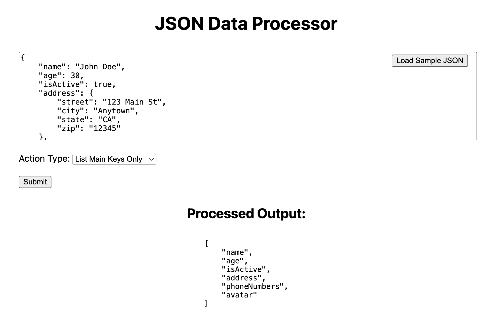
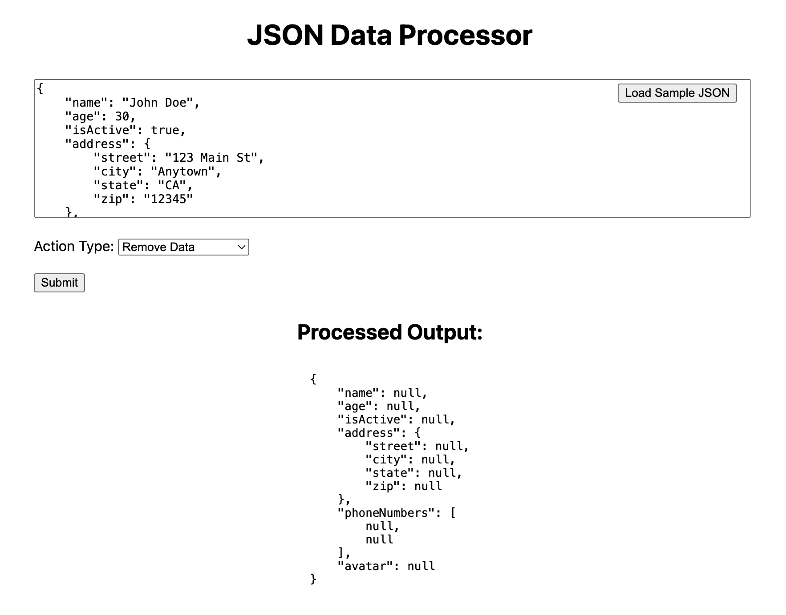
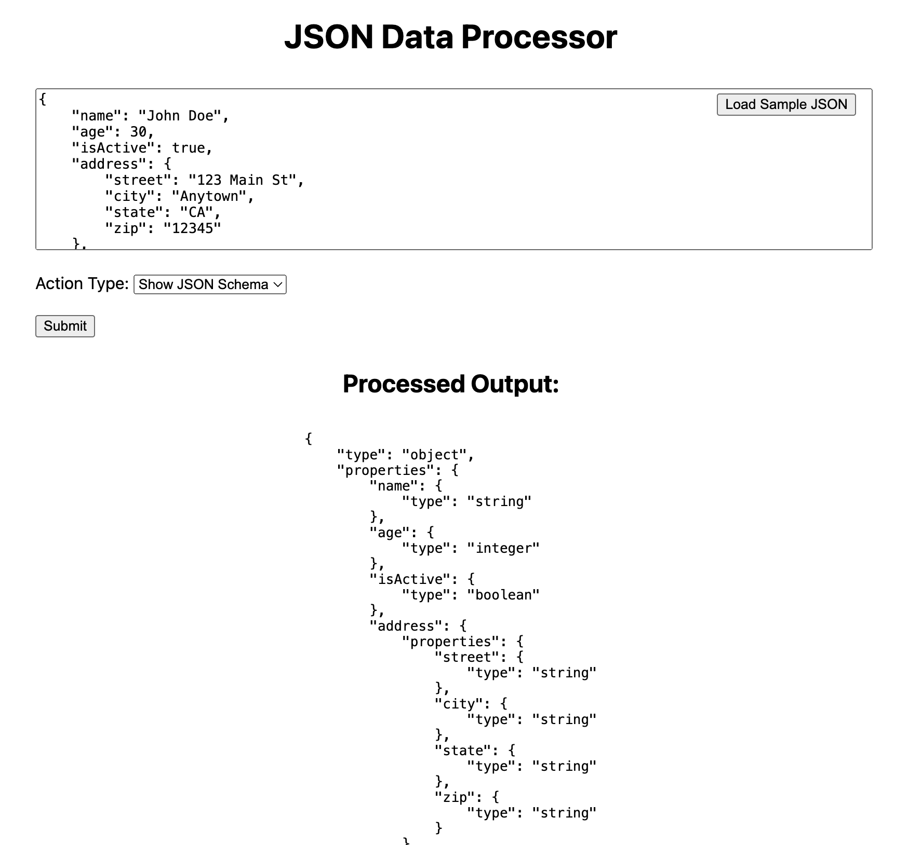
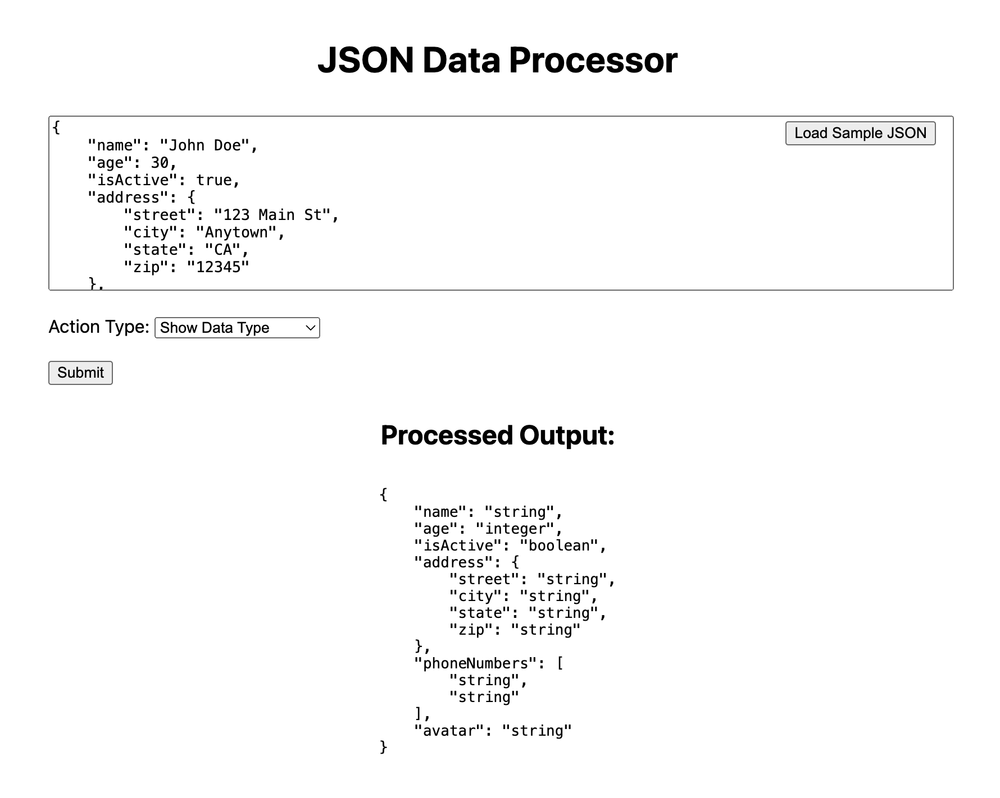

# JSON Data Processor

## Overview
This JSON Data Processor is a simple PHP-based web application that allows users to perform various operations on JSON data. Users can remove data values, list main keys, show data types, and generate a JSON schema describing the structure of the JSON data.

## Developer
- Thee Soontornsing, Toni Maxx, Jarus Soontornsing

## Website
- [LogicBaker](https://logicbaker.com)
- [EarthScene](https://earthscene.co)

## Features
- Remove all data values from JSON, leaving only keys.
- List all main keys from the JSON data.
- Display the data type of each value in the JSON.
- Generate and display a JSON schema based on the provided JSON.

## Installation
1. Clone the repository:
   ```
   git clone https://github.com/tonimaxx/BackendTools.git
   ```
2. Navigate to the project directory:
   ```
   cd jsontool
   ```
3. No additional setup is required, simply host the files on any PHP-enabled server.

## Usage
To use the JSON Data Processor, open the `jsontool.php` file in a web browser. You can input JSON data directly into the provided textarea or load a sample JSON by clicking the "Load Sample JSON" button. Select the desired operation from the dropdown menu and click "Submit" to process the JSON.

### Screenshots

#### List Main Keys Only


#### Remove Data


#### Show JSON Schema


#### Show Data Type


## License
This project is open-sourced under the MIT license.
